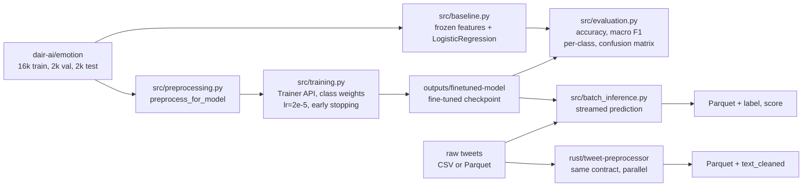

[](LICENSE)

# tweet-sentiment-analysis: Twitter-tuned RoBERTa emotion classification

Fine-tunes the task-agnostic `cardiffnlp/twitter-roberta-base` backbone on `dair-ai/emotion` and measures it against a frozen-features baseline: **0.887 macro F1 against 0.584** on the full 2,000-row test split.

## What It Does

Classifies short social-media text into six emotions, with the preprocessing, training, evaluation and batch-inference tooling around it.

- **Six-class emotion classification.** Labels text as anger, fear, joy, love, sadness or surprise, trained on `dair-ai/emotion` (16k train, 2k validation, 2k test).
- **One text-normalization contract.** `preprocess_for_model` collapses `@mentions` to `@user` and URLs to `http` while preserving case, hashtags and emoji. Training, evaluation and inference all call it, so the model never sees a text style it was not trained on.
- **Fine-tuning CLI.** `python -m src.training` runs the HuggingFace Trainer API with balanced class weights, early stopping, and subset flags that turn the same script into a fast smoke run.
- **Batch inference CLI.** `python -m src.batch_inference` streams a Parquet file in row chunks and writes predictions with a confidence score, so memory stays flat as the input grows.
- **Parallel preprocessing in Rust.** `rust/tweet-preprocessor` applies the same contract across CPU cores. `benchmarks/preprocessing_benchmark.py` compares it to the Python reference and checks that both produce identical output.
- **Frozen-features baseline.** `src/baseline.py` fits LogisticRegression on frozen backbone embeddings. It is the "before fine-tuning" reference the headline number is measured against.

## What It Is

A research codebase and ML pipeline. It produces a fine-tuned emotion classifier plus the scripts that train, evaluate and apply it. It is not a service: there is no REST API, no UI and no container yet (issues #36, #37, #38).

The project started as 3-class sentiment. Fine-tuning the already TweetEval-tuned `twitter-roberta-base-sentiment` on the same task regressed against its own baseline (issue #59), so the primary task moved to emotion on a task-agnostic backbone, where fine-tuning has something left to learn (ADR 0011). The v1 sentiment code is frozen at tag `v1-sentiment`.

## Tech Stack

| Layer | Technology |
| --- | --- |
| Language | Python 3.10 to 3.13, Rust (edition 2021) |
| ML and inference | HuggingFace Transformers, RoBERTa (`cardiffnlp/twitter-roberta-base`), PyTorch |
| Data | `dair-ai/emotion` via HuggingFace `datasets`, scikit-learn, pandas |
| Scale preprocessing | Rust CLI: `clap`, `rayon`, `polars`, `indicatif` |
| Batch inference | PyArrow streamed Parquet reads and writes |
| Tooling and CI | Ruff, pytest, `cargo test`, GitHub Actions |

## Architecture


```mermaid
flowchart LR
    A[dair-ai/emotion<br/>16k train, 2k val, 2k test] --> B[src/preprocessing.py<br/>preprocess_for_model]
    B --> C[src/training.py<br/>Trainer API, class weights<br/>lr=2e-5, early stopping]
    C --> D[outputs/finetuned-model<br/>fine-tuned checkpoint]
    D --> E[src/evaluation.py<br/>accuracy, macro F1<br/>per-class, confusion matrix]
    A --> I[src/baseline.py<br/>frozen features + LogisticRegression]
    I --> E
    G[raw tweets<br/>CSV or Parquet] --> H[rust/tweet-preprocessor<br/>same contract, parallel]
    H --> J[Parquet + text_cleaned]
    G --> F[src/batch_inference.py<br/>streamed prediction]
    D --> F
    F --> K[Parquet + label, score]
```

Two things in this graph are not obvious. First, `preprocess_for_model` is the only normalization on the model path: the heavier `clean_tweet_text` (lowercasing, `[URL]` tokens, demojizing) exists for exploratory work and is deliberately kept off that path, because the backbone was pretrained on the lighter convention (ADR 0009). Second, the Rust CLI is not a faster copy of a different pipeline. It implements the same contract token for token, and the benchmark script fails if the two outputs diverge. It exists to normalize bulk text ahead of other consumers, while `batch_inference` normalizes its own input, so raw tweets can go straight into either one.

## Engineering Decisions

Each row links the ADR under [`docs/adr/`](docs/adr/) holding the full rationale: the decision, the alternative considered, and why this approach.

| Decision | Rationale |
| --- | --- |
| Base model `twitter-roberta-base-sentiment` (v1 sentiment) | [ADR 0001](docs/adr/0001-base-model-twitter-roberta.md): domain-aligned, pre-trained on about 58M tweets. Amended by [ADR 0011](docs/adr/0011-emotion-task-pivot.md) for the emotion pivot |
| `max_length=128` tokens | [ADR 0002](docs/adr/0002-max-length-128.md): conservative margin over the 99th-percentile length |
| Macro F1 as primary metric | [ADR 0003](docs/adr/0003-macro-f1-primary-metric.md): the class distribution is imbalanced |
| URLs replaced by `[URL]` | [ADR 0004](docs/adr/0004-url-token-replacement.md): keep the link signal, drop the noise. Scoped to `clean_tweet_text`, not the model path |
| Emojis through `emoji.demojize()` | [ADR 0005](docs/adr/0005-emoji-demojize.md): keep sentiment-bearing emoji as text. Same scope as ADR 0004 |
| Early stopping `patience=2` | [ADR 0006](docs/adr/0006-early-stopping-patience.md): avoid overfitting a small train set |
| Rust CLI for scale preprocessing | [ADR 0007](docs/adr/0007-rust-cli-for-scale.md): parallel preprocessing, amended for the model-input contract |
| CPU-only PyTorch in CI | [ADR 0008](docs/adr/0008-cpu-only-pytorch-in-ci.md): avoid a CUDA download the tests never use |
| Model-path preprocessing | [ADR 0009](docs/adr/0009-model-path-preprocessing.md): one shared preprocessor matching the base model's input convention |
| Mixed-precision training | [ADR 0010](docs/adr/0010-mixed-precision-training.md): fp16 auto-enabled on CUDA to fit and speed up consumer-GPU fine-tuning |
| Pivot to emotion on a task-agnostic backbone | [ADR 0011](docs/adr/0011-emotion-task-pivot.md): restore a real fine-tuning gain after issue #59 |
| Balanced class weights, with ablation | [ADR 0012](docs/adr/0012-balanced-class-weights.md): mitigate the rare `surprise` class |

## Results

Both models were evaluated on the full `dair-ai/emotion` test split (2,000 rows).

| Model | Accuracy | Macro F1 |
| --- | --- | --- |
| Frozen-features baseline | 67.5% | 0.584 |
| **Fine-tuned, balanced class weights** | **92.3%** | **0.887** |

Also recorded in the same run:

- Macro F1 gain over the baseline: +51.9%.
- Class-weight ablation: 0.887 with weights against 0.877 without, so +0.010 macro F1.
- Calibration: expected calibration error 0.044.
- Largest per-class F1 gains: love +0.43, fear +0.33, surprise +0.32. The rare classes gain most.

**Where these numbers come from.** They are the recorded output of [`notebooks/06_emotion_evaluation.ipynb`](notebooks/06_emotion_evaluation.ipynb), which writes each value into its own markdown cells and into `outputs/nb06_summary.json`. Notebook outputs are stripped before commit, so the markdown cells are the durable record. The run used an RTX 3070 with fp16, seed 42 (`SEED` in `src/training.py`).

**Reproducing them is not a one-command job.** The fine-tuned checkpoint is gitignored, so the notebook retrains from scratch: it runs `train()` twice, once with class weights and once without for the ablation, then extracts frozen features for the baseline over the full train and test splits. That is two full fine-tuning runs, about 25 minutes each on an RTX 3070, plus the feature extraction. The next section describes what runs in minutes instead.

## Getting Started

### Prerequisites

- **Python 3.10 to 3.13.** The pins in `requirements.txt` are the upper bound: `numpy==2.2.6` publishes no wheel for 3.14, so 3.14 would build it from source. CI runs 3.10.
- **Internet access on the first run.** The backbone and the dataset are downloaded from Hugging Face on demand, roughly 1 GB of model weights plus a few MB of data, cached under `~/.cache/huggingface`. Both are public, so no account or token is needed.
- **Optional: a CUDA GPU.** Only for a full fine-tune. Everything else runs on CPU.
- **Optional: a stable Rust toolchain** via [rustup](https://rustup.rs/), only to build the preprocessing CLI. The crate sets `edition = "2021"` and declares no `rust-version`, so there is no stated minimum; it builds and tests clean on 1.95.

### Installation

```bash
git clone https://github.com/LukeSantossz/tweet-sentiment-analysis.git
cd tweet-sentiment-analysis
```

Create and activate a virtual environment. On Linux or macOS:

```bash
python -m venv venv
source venv/bin/activate
```

On Windows PowerShell:

```powershell
python -m venv venv
venv\Scripts\Activate.ps1
```

Then install:

```bash
pip install -r requirements.txt
```

On a machine without a CUDA GPU, install the CPU-only PyTorch wheel first to avoid downloading the CUDA build. This is what CI does:

```bash
pip install torch==2.12.1 --index-url https://download.pytorch.org/whl/cpu
pip install -r requirements.txt
```

The `.standards/` submodule holds the development standards and the review gates. It is not needed to run, test or train anything here. Clone it only if you intend to contribute:

```bash
git submodule update --init
```

### Configuration

There is nothing to configure. The project reads no environment variable and no `.env` file, and every path and hyperparameter has a default, overridable through the CLI flags in the [API Reference](#api-reference). Model and dataset names are constants in `src/training.py`.

### Running

Fastest way to see the project actually working, in order of cost:

```bash
# 1. Fast test suite. No network, no GPU. Under a minute.
python -m pytest tests/ -m "not slow" -q

# 2. Python preprocessing throughput on synthetic tweets. Add the Rust binary
#    (see below) and drop --skip-rust to get the parity check and a speedup.
python benchmarks/preprocessing_benchmark.py --sizes 1000 --skip-rust

# 3. Smoke fine-tune: 64 training rows, one epoch, CPU.
#    Proves the whole pipeline is wired. It downloads the backbone on the
#    first run and takes about a minute of training after that. The metrics
#    it reports are meaningless at this size, which is the point of a smoke run.
python -m src.training --max_train_samples 64 --max_eval_samples 32 --epochs 1 --output_dir ./outputs/smoke-model

# 4. Batch inference with the model step 3 just wrote. Build an input first.
python -c "import pyarrow as pa, pyarrow.parquet as pq; pq.write_table(pa.table({'text': ['i am so happy today', 'this is terrible and sad', '@x check http://y.co']}), 'tweets.parquet')"
python -m src.batch_inference --input tweets.parquet --output predictions.parquet --model ./outputs/smoke-model
```

Step 4 prints a throughput line and writes `predictions.parquet`. The labels it produces are noise, because the model from step 3 saw 64 rows. Point `--model` at a real fine-tune to get real predictions.

The full fine-tune is the expensive one. It took about 25 minutes on an RTX 3070 with fp16. On CPU it was estimated at roughly 25 hours and was never run to completion:

```bash
python -m src.training
```

The analysis notebooks run against the same code:

```bash
jupyter notebook
```

#### Rust preprocessing CLI

Takes any CSV or Parquet with a `text` column and writes a Parquet with a `text_cleaned` column added.

```bash
cargo build --release --manifest-path rust/tweet-preprocessor/Cargo.toml
printf 'text\n"Check @john #AI https://example.com"\n' > tweets.csv
./rust/tweet-preprocessor/target/release/tweet-preprocessor -i tweets.csv -o tweets_clean.parquet
```

The release profile enables LTO, so the first build takes several minutes. On Windows the binary is `tweet-preprocessor.exe`.

### Tests

```bash
# Python, excluding the tests that need a GPU, the network or a checkpoint
python -m pytest tests/ -m "not slow" -q

# Rust
cargo test --manifest-path rust/tweet-preprocessor/Cargo.toml

# Lint and format, the same two commands CI runs
python -m ruff check .
python -m ruff format --check .
```

That is 71 Python tests, 67 of which run in the fast suite, plus 7 Rust tests. On a machine without CUDA the fast suite reports one skip, an fp16 test that needs a GPU. The four excluded tests are marked `slow`: three download the backbone and run a forward pass, and one needs a fine-tuned checkpoint under `outputs/finetuned-model`, which is not in the repository. Run them with `python -m pytest tests/ -q`, and expect that last one to skip itself.

## API Reference

Three command-line surfaces, plus the Python package.

### `python -m src.training`

Fine-tunes the backbone and writes the best checkpoint.

| Flag | Description | Default |
| --- | --- | --- |
| `--output_dir` | Where to save checkpoints | `./outputs/finetuned-model` |
| `--epochs` | Number of training epochs | `3` |
| `--learning_rate` | AdamW learning rate | `2e-5` |
| `--train_batch_size` | Training batch size per device | `16` |
| `--eval_batch_size` | Evaluation batch size per device | `32` |
| `--fp16` / `--no-fp16` | Mixed precision | auto, on when CUDA is available |
| `--max_steps` | Cap total optimizer steps, `-1` to use epochs | `-1` |
| `--max_train_samples` | Use at most N training rows | all |
| `--max_eval_samples` | Use at most N validation rows | all |
| `--class-weights` / `--no-class-weights` | Balanced class weights in the loss | on |

```bash
python -m src.training --epochs 3 --output_dir ./outputs/finetuned-model
```

### `python -m src.batch_inference`

Predicts emotions over a Parquet file, streaming both directions. Output columns: `text_original`, `label`, `score`, `processing_time_ms`. Prints rows, elapsed seconds and rows per second at the end.

| Flag | Description | Default |
| --- | --- | --- |
| `--input` | Input Parquet with a text column (required) | |
| `--output` | Output Parquet, must differ from the input (required) | |
| `--text-column` | Name of the text column | `text` |
| `--batch-size` | Inference batch size | `64` |
| `--chunk-size` | Rows per streamed chunk | `10000` |
| `--model` | Fine-tuned model directory | `./outputs/finetuned-model` |

```bash
python -m src.batch_inference --input tweets.parquet --output predictions.parquet
```

### `tweet-preprocessor` (Rust)

Applies the model-input contract in parallel. Reads CSV or Parquet, writes Parquet with the input columns plus `text_cleaned`. Null text is treated as an empty string, so output stays row-aligned with input. See [`rust/tweet-preprocessor/README.md`](rust/tweet-preprocessor/README.md).

| Flag | Short | Description | Default |
| --- | --- | --- | --- |
| `--input` | `-i` | Input file, CSV or Parquet (required) | |
| `--output` | `-o` | Output Parquet (required) | |
| `--text-column` | `-c` | Column holding the text | `text` |
| `--threads` | `-j` | Thread count, `0` for auto | `0` |

```bash
./rust/tweet-preprocessor/target/release/tweet-preprocessor -i tweets.csv -o tweets_clean.parquet --threads 4
```

### `benchmarks/preprocessing_benchmark.py`

Generates synthetic tweets from a fixed seed, times both implementations, and verifies their outputs match row by row. It refuses to report a speedup when parity fails.

| Flag | Description | Default |
| --- | --- | --- |
| `--sizes` | Comma-separated dataset sizes | `1000,10000,100000` |
| `--rust-bin` | Path to the Rust binary | auto-detected |
| `--skip-rust` | Benchmark Python only | off |

### Python package

`src` re-exports the preprocessing functions without pulling in torch or transformers:

```python
from src import clean_tweet_text, preprocess_for_model

preprocess_for_model("Check @john #AI 😊 https://example.com")
# 'Check @user #AI 😊 http'
```

`src.training`, `src.evaluation`, `src.baseline` and `src.batch_inference` import the ML stack and are imported explicitly when needed.

## Project Structure

```
tweet-sentiment-analysis/
├── src/
│   ├── preprocessing.py            # Text cleaning: generic path and model-input contract
│   ├── training.py                 # Fine-tuning, metrics, class weights, CLI
│   ├── baseline.py                 # Frozen-features baseline
│   ├── evaluation.py               # Metric helpers and batched prediction
│   └── batch_inference.py          # Streamed Parquet inference CLI
├── rust/tweet-preprocessor/        # Parallel preprocessing CLI (rayon + polars)
├── benchmarks/                     # Python vs Rust throughput and parity check
├── tests/                          # 71 pytest tests, one file per source module
├── notebooks/                      # EDA, tokenization, evaluation, emotion comparison
├── docs/adr/                       # Architecture decision records, indexed above
├── docs/specs/                     # One approved spec per change
├── .github/workflows/ci.yml        # Lint, Python tests, Rust tests
├── .standards/                     # Development standards (git submodule, dev only)
├── pyproject.toml                  # Ruff and pytest configuration
└── requirements.txt                # Pinned Python dependencies
```

## Project Status

**In development.**

### Done

- Exploratory data analysis: class imbalance and noise patterns mapped
- Python preprocessing: 6 cleaning functions plus the model-input contract, 16 tests
- Tokenization analysis: `max_length=128` validated at the 99th percentile
- Training script: Trainer API, early stopping, class weights, CLI flags
- Emotion-task pivot: 6-class on `dair-ai/emotion`, task-agnostic backbone (issue #61)
- Fine-tuning run and comparative evaluation against the frozen-features baseline
- Class-weight ablation and per-class error analysis (notebook 06)
- Rust preprocessing CLI on the model-input contract, 7 tests
- Batch inference over streamed Parquet, 12 tests (issue #28)
- CI: ruff, pytest and cargo test on every push and pull request

### Pending

- Python vs Rust benchmark figures measured and published (the old numbers were measured on a preprocessing contract the CLI no longer implements, and were removed rather than restated)
- REST API with FastAPI (issue #36) and demo UI (issue #37)
- Docker packaging (issue #38)
- Pinned model revision and a lockfile for full reproducibility (issue #66)

## Known Issues & Limitations

- **The fine-tuned checkpoint is not in the repository.** It lands in `outputs/finetuned-model`, which is gitignored, so the Results numbers cannot be reproduced without retraining. That needs a GPU. The values are recorded in notebook 06 instead.
- **Training is GPU-bound.** About 25 minutes on an RTX 3070 with fp16. A CPU run was estimated at roughly 25 hours and abandoned; the `--max_train_samples` and `--max_steps` flags exist so the pipeline can still be exercised on CPU.
- **No published throughput numbers.** The Rust CLI is faster than the Python loop, but the figures that were once published measured a heavier cleaning contract that this CLI no longer implements. Run `benchmarks/preprocessing_benchmark.py` for numbers on your own machine.
- **The Rust CLI reads CSV and Parquet only.** JSON support was dropped over a Polars 0.46 API incompatibility.
- **Batch inference has never been run at million-row scale.** It streams in chunks so memory does not grow with the input, and that is what the tests cover; the throughput at that scale is unmeasured.
- **Dependencies are pinned but not locked.** `requirements.txt` pins direct dependencies only, and the model revision is not pinned, so a future Hugging Face upload could shift results (issue #66).
- **Python 3.14 is not covered.** `numpy==2.2.6` has no 3.14 wheel, so installing there compiles it from source.
- **`clean_tweet_text` has no pipeline caller.** The generic cleaner (lowercase, `[URL]` tokens, demojized emoji) is exported and tested, but nothing on the training, evaluation or inference path calls it, and the Rust CLI moved off it too. It stays as a utility and as the subject of ADR 0004 and ADR 0005, both of which record that scope.

## Contributing

The repository follows the standards in the `.standards/` submodule. CI runs lint and both test suites. The standards gates (spec, commit vocabulary, records, generated instruction files) run from `.githooks/`, which need the `mf` binary and one local setting, `git config core.hooksPath .githooks`. Wiring them into CI is issue #79.

1. Fork, then branch as `type/short-description` using the Conventional Commits type vocabulary.
2. Write a spec under `docs/specs/` for anything non-trivial, before the code.
3. Write the test first, then the implementation.
4. Keep `python -m pytest tests/ -m "not slow"`, `python -m ruff check .` and `cargo test` green.
5. Commit with Conventional Commits (`type(scope): imperative subject`), no AI attribution lines.

## License

MIT. See [LICENSE](LICENSE).
