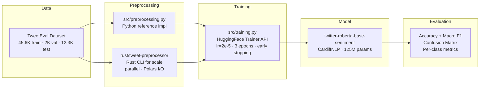

[](LICENSE)

# tweet-sentiment-analysis — Twitter-tuned RoBERTa sentiment classification

> A domain-tuned RoBERTa pipeline that classifies tweets as negative, neutral, or positive — paired with a Rust preprocessing CLI measured at **42x** the Python throughput on 100K tweets.

---

## What It Does

Classifies the sentiment of social-media text using a Twitter-specialized RoBERTa model, with a preprocessing path built to scale.

- **3-class sentiment classification** — labels tweets as negative, neutral, or positive against the TweetEval benchmark.
- **Tweet-aware text cleaning** — normalizes URLs, @mentions, hashtags, and emojis that break models trained on formal text.
- **Scale preprocessing** — a Rust CLI cleans 1M+ tweet workloads in parallel, a parity-validated 28.5x faster than the Python reference at 1M tweets (up to 42x at 100K on a faster single machine).
- **Reproducible baseline** — a zero-shot evaluation (70% accuracy, 0.71 macro F1) sets the bar the fine-tuning run aims to beat.

## What It Is

`tweet-sentiment-analysis` is a **research codebase / ML pipeline** that produces a sentiment classifier and the tooling around it (preprocessing, training, evaluation, benchmarks). It exists because generic sentiment models underperform on tweets — abbreviations, slang, mentions, hashtags, and emojis violate assumptions baked into models trained on formal corpora. The project fine-tunes `cardiffnlp/twitter-roberta-base-sentiment` on the TweetEval dataset and measures the gain over its zero-shot baseline on the shared TweetEval test split.

## Tech Stack

| Layer | Technology |
| --- | --- |
| Language | Python 3.10+ · Rust 1.88+ |
| ML / Inference | HuggingFace Transformers · RoBERTa (`cardiffnlp/twitter-roberta-base-sentiment`) · PyTorch |
| Data | TweetEval via HF `datasets` · scikit-learn · pandas |
| Scale preprocessing | Rust CLI — `clap` · `rayon` · `polars` · `unicode-segmentation` |
| Tooling / CI | Ruff · pytest · `cargo test` · GitHub Actions |

## Architecture


```mermaid
flowchart LR
    subgraph Data
        A[TweetEval Dataset<br/>45.6K train · 2K val · 12.3K test]
    end

    subgraph Preprocessing
        B1[src/preprocessing.py<br/>Python reference impl]
        B2[rust/tweet-preprocessor<br/>Rust CLI for scale<br/>parallel · Polars I/O]
    end

    subgraph Training
        C[src/training.py<br/>HuggingFace Trainer API<br/>lr=2e-5 · 3 epochs · early stopping]
    end

    subgraph Model
        D[twitter-roberta-base-sentiment<br/>CardiffNLP · 125M params]
    end

    subgraph Evaluation
        E[Accuracy + Macro F1<br/>Confusion Matrix<br/>Per-class metrics]
    end

    A --> B1 --> C
    A --> B2 --> C
    C --> D --> E
```

The model path (training and the future serving API) normalizes text with `preprocess_for_model`, aligned to the base model's input convention (see [ADR 0009](docs/adr/0009-model-path-preprocessing.md)). The generic `clean_tweet_text` (`src/preprocessing.py`, used by tests and notebooks) and its `rust/tweet-preprocessor` port share a separate cleaning contract for large-volume data and Python/Rust parity. See [`rust/tweet-preprocessor/README.md`](rust/tweet-preprocessor/README.md) for the CLI and its benchmark table. _The diagram above predates ADR 0009 and is refreshed in #35._

## Engineering Decisions

Each row links the ADR under [`docs/adr/`](docs/adr/) that holds the full rationale — the decision, the alternative considered, and why this approach.

| Decision | Rationale |
| --- | --- |
| Base model `twitter-roberta-base-sentiment` | [ADR 0001](docs/adr/0001-base-model-twitter-roberta.md) — domain-aligned, pre-trained on ~58M tweets |
| `max_length=128` tokens | [ADR 0002](docs/adr/0002-max-length-128.md) — conservative margin over the 99th-percentile length |
| Macro F1 as primary metric | [ADR 0003](docs/adr/0003-macro-f1-primary-metric.md) — the class distribution is imbalanced |
| URLs → `[URL]` token | [ADR 0004](docs/adr/0004-url-token-replacement.md) — keep the link signal, drop the noise |
| Emojis → `emoji.demojize()` | [ADR 0005](docs/adr/0005-emoji-demojize.md) — keep sentiment-bearing emoji as text |
| Early stopping `patience=2` | [ADR 0006](docs/adr/0006-early-stopping-patience.md) — avoid overfitting a small train set |
| Rust CLI for scale preprocessing | [ADR 0007](docs/adr/0007-rust-cli-for-scale.md) — parity-validated 28.5x at 1M tweets |
| CPU-only PyTorch in CI | [ADR 0008](docs/adr/0008-cpu-only-pytorch-in-ci.md) — avoid a ~2GB CUDA download |
| Model-path preprocessing | [ADR 0009](docs/adr/0009-model-path-preprocessing.md) — one shared preprocessor matching the base model's input convention |
| Mixed-precision training | [ADR 0010](docs/adr/0010-mixed-precision-training.md) — fp16 auto-on-CUDA to fit and speed up consumer-GPU fine-tuning |

## Results

The fine-tuning run has not been executed yet (see Project Status), so the only measured model result today is the zero-shot baseline, evaluated on a 1,000-example sample of the 12,284-row test split (reproduce with `notebooks/03_inference_baseline.ipynb`):

| Model | Accuracy | Macro F1 |
| --- | --- | --- |
| **Zero-shot baseline** | **70%** | **0.71** |
| Fine-tuned (pending) | — | — |

Per-class baseline F1: negative 0.70 · neutral 0.70 · positive 0.73 — performance is even across classes, which makes macro F1 a fair single-number target for the fine-tuned model to beat.

## Getting Started

### Prerequisites

- Python 3.10+ and pip
- (Optional) CUDA 11.x+ for GPU-accelerated fine-tuning
- (Optional) Rust 1.88+ (latest stable recommended) via [rustup](https://rustup.rs/) — only to build the scale preprocessing CLI

### Installation

```bash
git clone --recurse-submodules https://github.com/LukeSantossz/tweet-sentiment-analysis.git
cd tweet-sentiment-analysis
# already cloned without --recurse-submodules? run: git submodule update --init

python -m venv venv
source venv/bin/activate   # Linux / macOS
venv\Scripts\activate      # Windows

pip install -r requirements.txt
```

### Running

```bash
# Fine-tuning script (requires GPU for a practical runtime)
python -m src.training

# Linter
ruff check . && ruff format --check .

# Analysis notebooks
jupyter notebook
```

#### Rust preprocessing CLI (optional, for scale)

```bash
# Build the release binary
cd rust/tweet-preprocessor && cargo build --release

# Clean a CSV/Parquet of tweets into cleaned Parquet
./target/release/tweet-preprocessor -i data/tweets.csv -o data/tweets_clean.parquet
```

### Tests

```bash
# Python tests (skips the slow, GPU/network-bound suite)
pytest tests/ -m "not slow" -v

# Rust tests
cd rust/tweet-preprocessor && cargo test
```

## Project Structure

```
tweet-sentiment-analysis/
├── src/
│   ├── preprocessing.py            # Python tweet cleaning pipeline (reference impl)
│   └── training.py                 # Fine-tuning script — HuggingFace Trainer API
├── rust/
│   └── tweet-preprocessor/         # High-throughput preprocessing CLI (Rayon + Polars)
│       ├── src/main.rs             # Pipeline mirroring src/preprocessing.py
│       ├── Cargo.toml              # clap · polars · rayon · unicode-segmentation
│       └── README.md               # CLI usage and benchmark table
├── benchmarks/
│   └── preprocessing_benchmark.py  # Python vs Rust speedup, with parity check
├── tests/
│   ├── test_preprocessing.py       # 16 unit tests for the preprocessing functions
│   └── test_training.py            # 11 tests for the training module (config, metrics, wiring)
├── notebooks/
│   ├── 01_eda.ipynb                # Class distribution, noise patterns
│   ├── 02_tokenization.ipynb       # Token length distribution, max_length validation
│   └── 03_inference_baseline.ipynb # Zero-shot baseline: 70% acc, 0.71 macro F1
├── .github/workflows/ci.yml        # GitHub Actions: lint (ruff) + test (pytest)
├── .standards/                     # Development standards (my-framework submodule)
├── CLAUDE.md                       # Entry point binding the standards for AI-assisted work
├── pyproject.toml                  # Ruff and pytest configuration
└── requirements.txt                # Python dependencies (runtime + ruff/pytest)
```

## Project Status

**Status: in development**

### Done

- [x] Exploratory data analysis — class imbalance and noise patterns mapped
- [x] Python preprocessing pipeline — 6 cleaning functions + a model-aligned preprocessor, 16 passing tests
- [x] Tokenization analysis — `max_length=128` validated at the 99th percentile
- [x] Zero-shot baseline — 70% accuracy, 0.71 macro F1
- [x] Training script — Trainer API with early stopping and CLI args
- [x] Training module tests — 11 tests (config, metrics, constants, wiring)
- [x] CI pipeline — GitHub Actions with ruff + pytest
- [x] Rust preprocessing CLI — Rayon + Polars, 7 passing tests, 42x speedup at 100K

### Pending

- [ ] Execute the fine-tuning run (GPU-bound) and save the best checkpoint
- [ ] Comparative evaluation — baseline vs fine-tuned, per-class analysis
- [ ] Batch inference for 1M+ tweets
- [ ] Full Python-vs-Rust benchmark documented in this README
- [ ] REST API (FastAPI) and demo UI (Gradio)
- [ ] Docker containerization

## Known Issues & Limitations

- **No fine-tuned model yet** — `outputs/` is empty; every metric reported here is the zero-shot baseline, not a tuned model. Resolves once the training run executes on a GPU.
- **Training is GPU-bound** — a CPU-only run was estimated at ~25h, so fine-tuning is deferred to a GPU environment.
- **Partial Rust/Python emoji parity** — multi-codepoint emojis (flags, skin tones, ZWJ family sequences) may diverge between the two implementations; single-codepoint emojis, which dominate real tweets, produce identical output. Mitigated via grapheme-cluster handling.
- **Rust CLI is CSV/Parquet only** — JSON I/O was dropped due to a Polars 0.46 API incompatibility.

## License

This project is licensed under the MIT License — see the [LICENSE](LICENSE) file for details.
