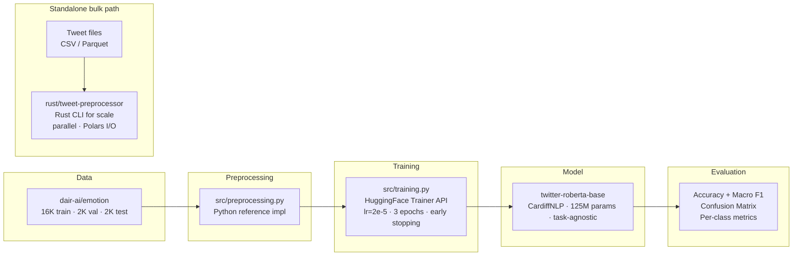

[](LICENSE)

# tweet-sentiment-analysis — Twitter-tuned RoBERTa emotion classification

> A domain-tuned RoBERTa pipeline that classifies tweets into six emotions (anger, fear, joy, love, sadness, surprise) — fine-tuning the task-agnostic `cardiffnlp/twitter-roberta-base` backbone on `dair-ai/emotion` to **0.887 macro F1** (+51.9% over the frozen-features baseline), with a streaming batch-inference CLI and a Rust CLI that applies the same input contract to bulk tweet files in parallel.

---

## What It Does

Classifies the emotion of social-media text using a Twitter-specialized RoBERTa model, with a preprocessing path built to scale.

- **6-class emotion classification** — labels tweets as anger, fear, joy, love, sadness, or surprise on the `dair-ai/emotion` dataset.
- **Tweet-aware text normalization** — collapses @mentions and URLs to the model's training convention, preserving the case, hashtags, and emoji that carry emotion signal.
- **Batch inference** — a streaming CLI (`python -m src.batch_inference`) classifies a Parquet file of tweets chunk by chunk and writes predictions back to Parquet, without loading the corpus into memory.
- **Scale preprocessing** — a Rust CLI applies the model's input contract (`preprocess_for_model`) to bulk CSV/Parquet files in parallel. Its output is pinned to the Python reference by mirrored unit fixtures; the end-to-end parity check is not automated (see Known Issues).
- **Frozen-features baseline** — a frozen-backbone linear probe (67.5% accuracy, 0.584 macro F1) sets the bar the fine-tuning run aims to beat.

## What It Is

`tweet-sentiment-analysis` is a **research codebase / ML pipeline** that produces an emotion classifier and the tooling around it (preprocessing, training, evaluation, benchmarks). It fine-tunes `cardiffnlp/twitter-roberta-base` (task-agnostic backbone) on `dair-ai/emotion` and measures the gain over a frozen-features baseline. The project pivoted from a v1 sentiment build after fine-tuning on TweetEval overfit the already-tuned base model (regression tracked in #59).

## Tech Stack

| Layer | Technology |
| --- | --- |
| Language | Python 3.10+ · Rust (stable, edition 2021) |
| ML / Inference | HuggingFace Transformers · RoBERTa (`cardiffnlp/twitter-roberta-base`) · PyTorch |
| Data | dair-ai/emotion via HF `datasets` · scikit-learn · pandas |
| Scale preprocessing | Rust CLI — `clap` · `rayon` · `polars` · `indicatif` |
| Tooling / CI | Ruff · pytest · `cargo test` · GitHub Actions |

## Architecture


```mermaid
flowchart LR
    subgraph Data
        A[dair-ai/emotion<br/>16K train · 2K val · 2K test]
    end

    subgraph Preprocessing
        B1[src/preprocessing.py<br/>Python reference impl]
    end

    subgraph Bulk["Standalone bulk path"]
        F[Tweet files<br/>CSV / Parquet]
        B2[rust/tweet-preprocessor<br/>Rust CLI for scale<br/>parallel · Polars I/O]
    end

    subgraph Training
        C[src/training.py<br/>HuggingFace Trainer API<br/>lr=2e-5 · 3 epochs · early stopping]
    end

    subgraph Model
        D[twitter-roberta-base<br/>CardiffNLP · 125M params · task-agnostic]
    end

    subgraph Evaluation
        E[Accuracy + Macro F1<br/>Confusion Matrix<br/>Per-class metrics]
    end

    A --> B1 --> C
    C --> D --> E
    F --> B2
```

The model path (training, batch inference, and the future serving API) normalizes text with `preprocess_for_model`, aligned to the base model's input convention (see [ADR 0009](docs/adr/0009-model-path-preprocessing.md)). Training loads `dair-ai/emotion` directly from HuggingFace and preprocesses in-process; it does not read the Rust CLI's output.

The `rust/tweet-preprocessor` CLI implements the same input contract for bulk files and runs as a standalone tool rather than a stage of the training pipeline (see [ADR 0007](docs/adr/0007-rust-cli-for-scale.md) and [`rust/tweet-preprocessor/README.md`](rust/tweet-preprocessor/README.md)). The two implementations are kept aligned by mirrored unit fixtures on both sides; no automated end-to-end parity check runs in CI.

## Engineering Decisions

Each row links the ADR under [`docs/adr/`](docs/adr/) that holds the full rationale — the decision, the alternative considered, and why this approach.

| Decision | Rationale |
| --- | --- |
| Base model `twitter-roberta-base-sentiment` (v1 sentiment) | [ADR 0001](docs/adr/0001-base-model-twitter-roberta.md) — domain-aligned, pre-trained on ~58M tweets; amended by [ADR 0011](docs/adr/0011-emotion-task-pivot.md) for the emotion pivot |
| `max_length=128` tokens | [ADR 0002](docs/adr/0002-max-length-128.md) — conservative margin over the 99th-percentile length |
| Macro F1 as primary metric | [ADR 0003](docs/adr/0003-macro-f1-primary-metric.md) — the class distribution is imbalanced |
| URLs → `[URL]` token | [ADR 0004](docs/adr/0004-url-token-replacement.md) — keep the link signal, drop the noise. Applies to the generic `clean_tweet_text` utility only; the model path uses `preprocess_for_model` (ADR 0009) |
| Emojis → `emoji.demojize()` | [ADR 0005](docs/adr/0005-emoji-demojize.md) — keep sentiment-bearing emoji as text. Applies to the generic `clean_tweet_text` utility only; the model path preserves emoji as-is (ADR 0009) |
| Early stopping `patience=2` | [ADR 0006](docs/adr/0006-early-stopping-patience.md) — avoid overfitting a small train set |
| Rust CLI for scale preprocessing | [ADR 0007](docs/adr/0007-rust-cli-for-scale.md) — parallel scale preprocessing, amended for the model-input contract (emotion pivot) |
| CPU-only PyTorch in CI | [ADR 0008](docs/adr/0008-cpu-only-pytorch-in-ci.md) — avoid a ~2GB CUDA download |
| Model-path preprocessing | [ADR 0009](docs/adr/0009-model-path-preprocessing.md) — one shared preprocessor matching the base model's input convention |
| Mixed-precision training | [ADR 0010](docs/adr/0010-mixed-precision-training.md) — fp16 auto-on-CUDA to fit and speed up consumer-GPU fine-tuning |
| Pivot to emotion + task-agnostic backbone | [ADR 0011](docs/adr/0011-emotion-task-pivot.md) — restore a real fine-tuning gain after #59 |
| Balanced class weights (with ablation) | [ADR 0012](docs/adr/0012-balanced-class-weights.md) — mitigate the imbalanced surprise class |

## Results

Both models are evaluated on the **full** `dair-ai/emotion` test split (2,000 rows), with `SEED=42` (`src/training.py`). Reproduce by running `notebooks/06_emotion_evaluation.ipynb` end to end on Python 3.10+ with the pinned `requirements.txt`; the notebook retrains both the weighted and unweighted runs, so a GPU is required for a practical runtime. No metrics artifact is committed — `outputs/` is gitignored, so a fresh clone cannot verify these numbers without rerunning the training.

| Model | Accuracy | Macro F1 |
| --- | --- | --- |
| Frozen-features baseline | 67.5% | 0.584 |
| **Fine-tuned** | **92.3%** | **0.887** |

Fine-tuning beat the frozen-features baseline by **+51.9% macro F1** (0.887 vs 0.584). Class-weight ablation contributed +0.010 macro F1 (0.887 with weights vs 0.877 without). Calibration ECE is 0.044. The rarest class (`surprise`, 3.57% of train) and other rare classes gain most from fine-tuning (love +0.43, fear +0.33, surprise +0.32 macro F1). v1 (3-class TweetEval sentiment) is frozen at tag `v1-sentiment`; its regression finding is #59.

## Getting Started

### Prerequisites

- Python 3.10+ and pip
- (Optional) CUDA 11.x+ for GPU-accelerated fine-tuning
- (Optional) Rust, latest stable, via [rustup](https://rustup.rs/) — only to build the scale preprocessing CLI. The crate declares no `rust-version`; its `edition = "2021"` sets the real floor.

### Installation

```bash
git clone --recurse-submodules https://github.com/LukeSantossz/tweet-sentiment-analysis.git
cd tweet-sentiment-analysis
# already cloned without --recurse-submodules? run: git submodule update --init

python -m venv .venv
source .venv/bin/activate   # Linux / macOS
.venv\Scripts\activate      # Windows

pip install -r requirements.txt
```

### Running

```bash
# Fine-tuning script (requires GPU for a practical runtime)
python -m src.training

# Batch inference over a Parquet of tweets (needs a fine-tuned model directory)
python -m src.batch_inference --input data/tweets.parquet --output data/predictions.parquet

# Linter
ruff check . && ruff format --check .

# Analysis notebooks
jupyter notebook
```

Batch inference streams the input in row chunks, so memory stays flat on large files. `--model` defaults to `./outputs/finetuned-model`, which only exists after a training run. Other flags: `--text-column` (default `text`), `--batch-size` (default 64), `--chunk-size` (default 10000). The output Parquet carries `text_original`, `label`, `score`, and `processing_time_ms`.

#### Rust preprocessing CLI (optional, for scale)

```bash
# Build the release binary
cd rust/tweet-preprocessor && cargo build --release

# Clean a CSV/Parquet of tweets into cleaned Parquet
./target/release/tweet-preprocessor -i data/tweets.csv -o data/tweets_clean.parquet
```

### Tests

```bash
# Python tests (skips the slow, GPU/network-bound suite)
pytest tests/ -m "not slow" -v

# Rust tests
cd rust/tweet-preprocessor && cargo test
```

## Project Structure

```
tweet-sentiment-analysis/
├── src/
│   ├── preprocessing.py            # Tweet cleaning: generic + model-aligned paths
│   ├── training.py                 # Fine-tuning + metrics — HuggingFace Trainer API
│   ├── baseline.py                 # Frozen-features baseline (backbone + LogisticRegression)
│   ├── batch_inference.py          # Streaming Parquet-to-Parquet batch classification CLI
│   └── evaluation.py               # Metric helpers + batched inference for comparison
├── rust/
│   └── tweet-preprocessor/         # High-throughput preprocessing CLI (Rayon + Polars)
│       ├── src/main.rs             # Pipeline mirroring src/preprocessing.py
│       ├── Cargo.toml              # clap · polars · rayon · indicatif
│       └── README.md               # CLI usage and arguments
├── benchmarks/
│   └── preprocessing_benchmark.py  # Python vs Rust speedup, with parity check
├── tests/
│   ├── test_preprocessing.py       # Preprocessing unit tests
│   ├── test_training.py            # Training config, metrics, class weights, wiring
│   ├── test_evaluation.py          # Evaluation metric helpers
│   ├── test_baseline.py            # Frozen-features baseline
│   ├── test_batch_inference.py     # Batch-inference CLI, streaming, and schema
│   └── test_benchmark.py           # Benchmark parity helper
├── notebooks/
│   ├── 01_eda.ipynb                # Class distribution, noise patterns
│   ├── 02_tokenization.ipynb       # Token length distribution, max_length validation
│   ├── 03_inference_baseline.ipynb # Zero-shot inference baseline exploration
│   ├── 05_evaluation.ipynb         # v1 sentiment: fine-tuned vs baseline (tag-pinned history)
│   └── 06_emotion_evaluation.ipynb # Emotion: fine-tuned vs frozen-features baseline
├── .github/workflows/ci.yml        # GitHub Actions: lint (ruff) + test (pytest) + rust
├── .standards/                     # Development standards (my-framework submodule)
├── CLAUDE.md                       # Entry point binding the standards for AI-assisted work
├── pyproject.toml                  # Ruff and pytest configuration
└── requirements.txt                # Python dependencies (runtime + ruff/pytest)
```

## Project Status

**Status: in development**

### Done

- [x] Exploratory data analysis — class imbalance and noise patterns mapped
- [x] Python preprocessing pipeline — 6 cleaning functions + a model-aligned preprocessor, 16 passing tests
- [x] Tokenization analysis — `max_length=128` validated at the 99th percentile
- [x] Zero-shot baseline (v1 sentiment) — 0.724 accuracy, 0.724 macro F1 on the full split (notebook 05; supersedes an earlier 70% / 0.71 figure measured on a 1,000-example sample)
- [x] Training script — Trainer API with early stopping and CLI args
- [x] Training module tests — config, metrics, class weights, wiring
- [x] CI pipeline — GitHub Actions with ruff + pytest
- [x] Rust preprocessing CLI — Rayon + Polars, model-input contract, 7 passing tests
- [x] Fine-tuning run (v1 sentiment) — `python -m src.training` (GPU venv: Python 3.12, torch 2.12.1+cu130, RTX 3070); best checkpoint at epoch 2, validation accuracy 0.817 / macro F1 0.808 — superseded by the emotion pivot (#61)
- [x] Comparative evaluation — baseline vs fine-tuned, per-class analysis (#27)
- [x] Emotion-task pivot — 6-class emotion on dair-ai/emotion, task-agnostic backbone (#61)
- [x] Frozen-features baseline
- [x] Class-weight ablation
- [x] Extended error analysis (notebook 06)
- [x] Streaming batch-inference CLI — Parquet in, predictions out, 12 tests

### Pending
- [ ] Automated Python-vs-Rust parity check in CI (currently pinned only by mirrored fixtures)
- [ ] Full Python-vs-Rust benchmark documented in this README
- [ ] A committed metrics artifact so a fresh clone can verify the Results table without retraining
- [ ] CI coverage of at least one real model forward pass (all model-touching tests are `slow` and deselected)
- [ ] REST API (FastAPI) and demo UI (Gradio)
- [ ] Docker containerization

## Known Issues & Limitations

- **Fine-tuned checkpoint is local, not versioned** — the emotion fine-tune produced a best checkpoint under `outputs/finetuned-model` (gitignored); see Results for the measured metrics (92.3% accuracy, 0.887 macro F1 vs the 0.584 frozen-features baseline). v1 (3-class TweetEval sentiment) is frozen at tag `v1-sentiment`; its regression is #59.
- **Training is GPU-bound** — a CPU-only run was estimated at ~25h; the fine-tune was run on an RTX 3070 (fp16) in ~25 min.
- **Rust CLI is CSV/Parquet only** — JSON I/O was dropped due to a Polars 0.46 API incompatibility.
- **Cross-language parity is not enforced automatically** — the Python and Rust preprocessors are kept aligned by hand-mirrored unit fixtures on each side. The live comparator in `benchmarks/preprocessing_benchmark.py` needs a built Rust binary, which CI never produces, so editing one implementation and its own fixture leaves CI green while the two diverge on untested input.
- **Rust throughput is unmeasured for the current contract** — the earlier speedup figures were measured on the heavier bulk-cleaning contract and no longer apply after the switch to the model-input contract; they are deliberately not restated here rather than reprinted as if still valid.
- **CI never runs a model forward pass** — every test that loads a model is marked `slow` and deselected by the CI command, and the end-to-end batch-inference test additionally skips on the gitignored checkpoint, so it cannot run in CI under any condition.
- **No coverage measurement** — the project declares no coverage tooling, so there is no figure and no regression floor.
- **`tqdm` is imported but undeclared** — `src/batch_inference.py` imports it while `requirements.txt` does not list it; it currently resolves transitively through `transformers`/`datasets`.
- **Notebooks 01–03 analyse the abandoned v1 sentiment task** — they load `cardiffnlp/tweet_eval` sentiment rather than `dair-ai/emotion` and carry no staleness banner, unlike notebook 05.

## License

This project is licensed under the MIT License — see the [LICENSE](LICENSE) file for details.
