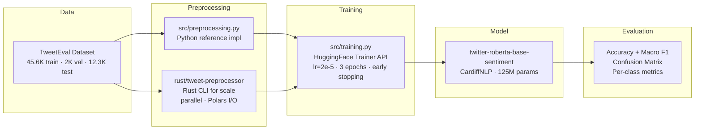

# tweet-sentiment-analysis

> Fine-tuned RoBERTa model for 3-class sentiment classification on tweets, evaluated against the TweetEval benchmark.

## Why This Exists

Generic sentiment models underperform on social media text. Tweets contain abbreviations, slang, @mentions, hashtags, and emojis that break assumptions built into models trained on formal corpora. This project fine-tunes a Twitter-specialized RoBERTa variant (`cardiffnlp/twitter-roberta-base-sentiment`) on the TweetEval benchmark dataset to classify tweets as **negative**, **neutral**, or **positive** — and measures the gain over the zero-shot baseline.

The zero-shot baseline achieves 70% accuracy and 0.71 macro F1. The fine-tuning pipeline is built to surpass these numbers on the same test split (12,284 samples).

## Architecture


```mermaid
flowchart LR
    subgraph Data
        A[TweetEval Dataset<br/>45.6K train · 2K val · 12.3K test]
    end

    subgraph Preprocessing
        B1[src/preprocessing.py<br/>Python reference impl]
        B2[rust/tweet-preprocessor<br/>Rust CLI for scale<br/>parallel · Polars I/O]
    end

    subgraph Training
        C[src/training.py<br/>HuggingFace Trainer API<br/>lr=2e-5 · 3 epochs · early stopping]
    end

    subgraph Model
        D[twitter-roberta-base-sentiment<br/>CardiffNLP · 125M params]
    end

    subgraph Evaluation
        E[Accuracy + Macro F1<br/>Confusion Matrix<br/>Per-class metrics]
    end

    A --> B1 --> C
    A --> B2 --> C
    C --> D --> E
```

The Python pipeline (`src/preprocessing.py`) is the reference implementation used by tests and notebooks. The Rust CLI (`rust/tweet-preprocessor`) is the production path for large-volume preprocessing, with measured speedups up to 42x on 100K tweets. See [`rust/tweet-preprocessor/README.md`](rust/tweet-preprocessor/README.md) for details.

## Engineering Decisions

| Decision | Rationale |
|----------|-----------|
| **Model: `twitter-roberta-base-sentiment`** | Pre-trained on ~58M tweets — domain-aligned, no need for domain adaptation from scratch. |
| **`max_length=128` tokens** | 99th percentile of token lengths is ~55. 128 is conservative but avoids any truncation artifacts. |
| **Macro F1 as primary metric** | Dataset is imbalanced (neutral ~45%, positive ~30%, negative ~22%). Macro F1 penalizes poor performance on minority classes. |
| **URLs replaced with `[URL]` token** | Preserves signal that a URL was present without introducing noise from the URL content itself. |
| **Emojis converted via `emoji.demojize()`** | Transforms emojis into descriptive text (e.g., `:fire:`) readable by the tokenizer, preserving sentiment signal. |
| **Early stopping with `patience=2`** | Prevents overfitting on the relatively small training set without manual epoch tuning. |
| **CPU-only PyTorch in CI** | Avoids ~2GB CUDA download in the pipeline. Slow tests requiring GPU/network are excluded via pytest marker. |
| **Ruff for linting** | Fast, Rust-based linter. Rules E/F/I with `line-length=120`. Notebooks excluded (not production code). |
| **Rust CLI for production preprocessing** | Python reference pipeline is the source of truth; a Rust port (`rust/tweet-preprocessor`) handles 1M+ tweet workloads with Rayon parallelism and Polars I/O. Measured 42x speedup at 100K samples. Parity validated on single-codepoint emojis; multi-codepoint sequences handled via grapheme clusters. |

## Getting Started

### Prerequisites

- Python 3.10+
- pip
- (Optional) CUDA 11.x+ for GPU acceleration
- (Optional) Rust 1.70+ via [rustup](https://rustup.rs/) — only needed to build the high-throughput preprocessing CLI

### Installation

```bash
git clone https://github.com/LukeSantossz/tweet-sentiment-analysis.git
cd tweet-sentiment-analysis

python -m venv venv
source venv/bin/activate   # Linux / macOS
venv\Scripts\activate      # Windows

pip install -r requirements.txt
```

### Running

```bash
# Run the fine-tuning script
python -m src.training

# Run Python tests
pytest tests/ -m "not slow" -v

# Run linter
ruff check . && ruff format --check .

# Launch Jupyter for analysis notebooks
jupyter notebook
```

#### Rust preprocessing CLI (optional, for scale)

```bash
# Build release binary
cd rust/tweet-preprocessor && cargo build --release

# Preprocess a CSV/Parquet of tweets into cleaned Parquet
./target/release/tweet-preprocessor -i data/tweets.csv -o data/tweets_clean.parquet

# Run Rust unit tests
cargo test
```

### Environment Variables

| Variable | Description | Default |
|----------|-------------|---------|
| `HF_DATASETS_CACHE` | Hugging Face Datasets cache directory | `~/.cache/huggingface/datasets` |
| `TRANSFORMERS_CACHE` | Pre-trained model cache directory | `~/.cache/huggingface/transformers` |
| `CUDA_VISIBLE_DEVICES` | GPU index(es) to use | `0` |

## Project Structure

```
tweet-sentiment-analysis/
├── src/
│   ├── __init__.py
│   ├── preprocessing.py            # Python tweet cleaning pipeline (reference impl)
│   └── training.py                 # Fine-tuning script with HuggingFace Trainer API
├── rust/
│   └── tweet-preprocessor/         # High-throughput preprocessing CLI (Rayon + Polars)
│       ├── src/main.rs             # Pipeline mirroring src/preprocessing.py
│       ├── Cargo.toml              # Rust dependencies (clap, polars, rayon, unicode-segmentation)
│       └── README.md               # CLI usage and benchmark details
├── benchmarks/
│   └── preprocessing_benchmark.py  # Python vs Rust speedup measurement with parity check
├── tests/
│   ├── test_preprocessing.py       # 12 unit tests for preprocessing functions
│   └── test_training.py            # 9 tests for training module (config, metrics, constants)
├── notebooks/
│   ├── 01_eda.ipynb                # Exploratory data analysis: class distribution, text patterns
│   ├── 02_tokenization.ipynb       # Token length distribution, max_length validation
│   └── 03_inference_baseline.ipynb # Zero-shot baseline: 70% acc, 0.71 macro F1
├── .github/
│   └── workflows/
│       └── ci.yml                  # GitHub Actions: lint (ruff) + test (pytest)
├── .claude/                        # AI agent governance rules and project registry
├── pyproject.toml                  # Ruff and pytest configuration
├── requirements.txt                # Python runtime dependencies
├── requirements-dev.txt            # Python dev dependencies (ruff, pytest)
└── README.md
```

## Current Status

| Stage | Status | Details |
|-------|--------|---------|
| Exploratory Data Analysis | Done | Class imbalance identified, noise patterns mapped |
| Preprocessing Pipeline (Python) | Done | 6 cleaning functions, 12 passing tests |
| Tokenization Analysis | Done | max_length=128 validated at 99th percentile |
| Zero-shot Baseline | Done | 70% accuracy, 0.71 macro F1 |
| Training Script | Done | Trainer API, early stopping, CLI args |
| Training Module Tests | Done | 9 tests covering config, metrics, constants |
| CI Pipeline | Done | GitHub Actions with ruff + pytest |
| Rust Preprocessing CLI | Done | Rayon + Polars, 7 passing tests, 42x speedup at 100K |
| Fine-tuning Execution | Pending | Script ready, awaiting GPU execution |
| Batch Inference (1M+ tweets) | Pending | Planned in TASK-021 |
| Benchmark Documentation | Pending | Planned in TASK-022 / TASK-023 |
| Comparative Evaluation | Pending | Baseline vs fine-tuned, per-class analysis |
| REST API (FastAPI) | Planned | POST /predict endpoint |
| Demo UI (Gradio) | Planned | Interactive frontend |
| Docker Containerization | Planned | Dockerfile + docker-compose |
